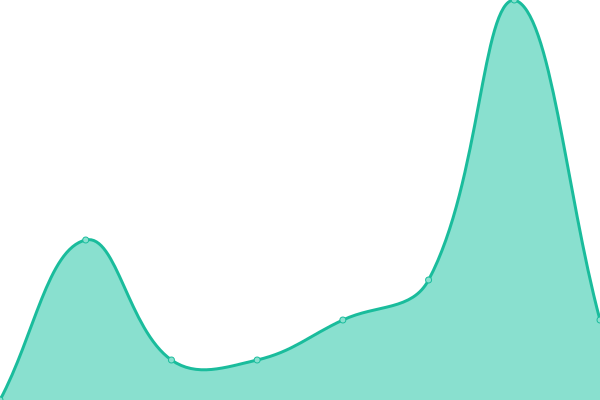

# [📈 Live Status](https://Lawlietr.github.io/upptime): <!--live status--> **🟧 Partial outage**

This repository contains the open-source uptime monitor and status page for [Lawlietr](https://Lawlietr.github.io/upptime), powered by [Upptime](https://github.com/upptime/upptime).

With [Upptime](https://upptime.js.org), you can get your own unlimited and free uptime monitor and status page, powered entirely by a GitHub repository. We use [Issues](https://github.com/Lawlietr/upptime/issues) as incident reports, [Actions](https://github.com/Lawlietr/upptime/actions) as uptime monitors, and [Pages](https://Lawlietr.github.io/upptime) for the status page.

<!--start: status pages-->
<!-- This summary is generated by Upptime (https://github.com/upptime/upptime) -->
<!-- Do not edit this manually, your changes will be overwritten -->
<!-- prettier-ignore -->
| URL | Status | History | Response Time | Uptime |
| --- | ------ | ------- | ------------- | ------ |
|  H | 🟥 Down | [h.yml](https://github.com/Lawlietr/upptime/commits/HEAD/history/h.yml) | 

 652ms
     
 | 

<a href="https://Lawlietr.github.io/upptime/history/h">97.57%</a>
    

|  J | 🟥 Down | [j.yml](https://github.com/Lawlietr/upptime/commits/HEAD/history/j.yml) | 

 730ms
     
 | 

<a href="https://Lawlietr.github.io/upptime/history/j">98.38%</a>
    

|  BDR | 🟩 Up | [bdr.yml](https://github.com/Lawlietr/upptime/commits/HEAD/history/bdr.yml) | 

 725ms
     
 | 

<a href="https://Lawlietr.github.io/upptime/history/bdr">100.00%</a>
    

|  [PCDVD](https://www.pcdvd.com.tw) | 🟩 Up | [pcdvd.yml](https://github.com/Lawlietr/upptime/commits/HEAD/history/pcdvd.yml) | 

 812ms
     
 | 

<a href="https://Lawlietr.github.io/upptime/history/pcdvd">100.00%</a>
    

|  [PTT](https://term.ptt.cc) | 🟥 Down | [ptt.yml](https://github.com/Lawlietr/upptime/commits/HEAD/history/ptt.yml) | 

 138ms
     
 | 

<a href="https://Lawlietr.github.io/upptime/history/ptt">100.00%</a>
    

|  NH | 🟩 Up | [nh.yml](https://github.com/Lawlietr/upptime/commits/HEAD/history/nh.yml) | 

 290ms
     
 | 

<a href="https://Lawlietr.github.io/upptime/history/nh">100.00%</a>
    

|  PH | 🟩 Up | [ph.yml](https://github.com/Lawlietr/upptime/commits/HEAD/history/ph.yml) | 

 2105ms
     
 | 

<a href="https://Lawlietr.github.io/upptime/history/ph">100.00%</a>
    

|  [Google](https://www.google.com) | 🟩 Up | [google.yml](https://github.com/Lawlietr/upptime/commits/HEAD/history/google.yml) | 

 145ms
     
 | 

<a href="https://Lawlietr.github.io/upptime/history/google">100.00%</a>
    

|  [Youtube](https://www.youtube.com) | 🟩 Up | [youtube.yml](https://github.com/Lawlietr/upptime/commits/HEAD/history/youtube.yml) | 

 201ms
     
 | 

<a href="https://Lawlietr.github.io/upptime/history/youtube">100.00%</a>
    

|  [facebook](https://www.facebook.com) | 🟩 Up | [facebook.yml](https://github.com/Lawlietr/upptime/commits/HEAD/history/facebook.yml) | 

 379ms
     
 | 

<a href="https://Lawlietr.github.io/upptime/history/facebook">100.00%</a>
    

|  [Google DNS1](8.8.8.8) | 🟩 Up | [google-dns-1.yml](https://github.com/Lawlietr/upptime/commits/HEAD/history/google-dns-1.yml) | 

 3ms
     
 | 

<a href="https://Lawlietr.github.io/upptime/history/google-dns-1">100.00%</a>
    

|  [Cloudflare DNS1](1.1.1.1) | 🟩 Up | [cloudflare-dns-1.yml](https://github.com/Lawlietr/upptime/commits/HEAD/history/cloudflare-dns-1.yml) | 

 4ms
     
 | 

<a href="https://Lawlietr.github.io/upptime/history/cloudflare-dns-1">100.00%</a>
    

<!--end: status pages-->

[**Visit our status website →**](https://Lawlietr.github.io/upptime)

## 📄 License

- Powered by: [Upptime](https://github.com/upptime/upptime)
- Code: [MIT](./LICENSE) © [Anand Chowdhary](https://anandchowdhary.com), supported by [Pabio](https://pabio.com)
- Data in the `./history` directory: [Open Database License](https://opendatacommons.org/licenses/odbl/1-0/)
